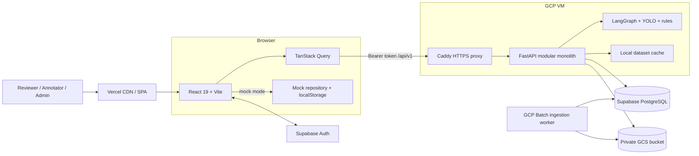
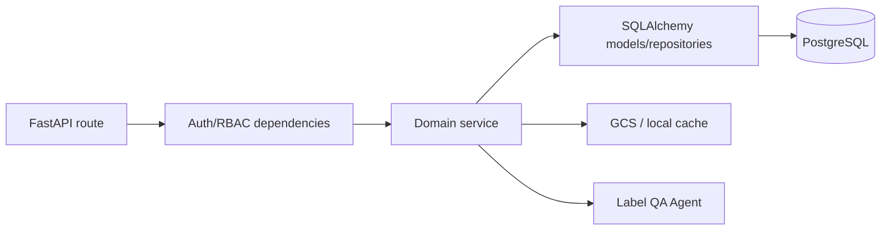
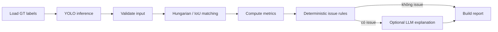
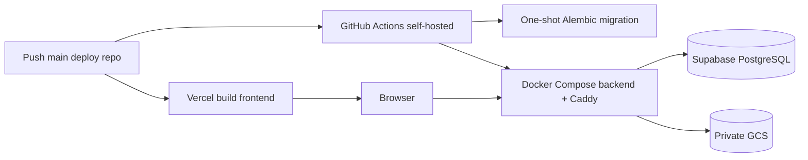

# Architecture — Label Guardian

> Cập nhật: 2026-08-27
> Phạm vi: kiến trúc đang tồn tại trong source code, migration và cấu hình triển khai hiện tại.

Tài liệu này được lấy từ bản `ARCHITECTURE.md` trên nhánh `main` và viết lại theo phiên bản hiện tại của dự án. Khi tài liệu và hệ thống khác nhau, thứ tự nguồn chuẩn là:

1. Alembic migrations và ORM models cho schema dữ liệu.
2. `docs/openapi.json` và FastAPI routes cho API contract.
3. Source code frontend/backend cho hành vi runtime.
4. Cấu hình Vercel, Docker Compose, Caddy và GitHub Actions cho deployment.

Các ý tưởng chưa có trong code phải được ghi rõ là roadmap, không được mô tả như tính năng production.

## 1. Tổng quan hệ thống

Label Guardian là nền tảng QA và chỉnh sửa annotation camera 2D cho dữ liệu perception. Hệ thống ingest dữ liệu KITTI/nuScenes, dùng model và rule deterministic để phát hiện annotation đáng ngờ, đưa finding vào QA workflow và cho phép người dùng sửa nhãn trong 2D Editor tích hợp.

Các ranh giới chính:

| Thành phần | Trách nhiệm hiện tại |
| --- | --- |
| React frontend | Landing page, đăng nhập, dashboard, QA Queue, QA Cases, 2D Editor, reports, dataset và pipeline views |
| Supabase Auth | Identity, password, email confirmation, access/refresh session |
| FastAPI | Xác minh token, RBAC, dataset API, private asset streaming, Agent evaluation, QA workflow và annotation revisions |
| Supabase PostgreSQL | User profile/role, dataset metadata, provenance, evaluation, case, audit và revision |
| Google Cloud Storage | Ảnh, point cloud, raw/canonical dataset và ingestion artifacts |
| Label QA Agent | YOLO inference, matching, metrics, deterministic flagging và explanation tùy chọn |
| GCP Batch ingestion | Tải/chuẩn hóa/publish dataset lớn ngoài request path của API |

CVAT không còn nằm trong runtime hiện tại. Migration `20260822_0002` đã thay tích hợp CVAT bằng 2D Editor có revision và xóa mapping/schema CVAT cũ.

## 2. Sơ đồ kiến trúc đang chạy



Public topology:

```text
https://labelguardian.space       -> Vercel frontend
https://www.labelguardian.space   -> Vercel frontend
https://api.labelguardian.space   -> Caddy -> FastAPI trên GCP VM
```

## 3. Runtime modes

Frontend có hai trục cấu hình độc lập:

| Biến | Giá trị | Hành vi |
| --- | --- | --- |
| `VITE_DATA_SOURCE` | `api` | Dùng `/api/v1` cho dataset, QA case, editor, report và pipeline data có hỗ trợ |
| `VITE_DATA_SOURCE` | `mock` | Dùng fixture và `MockRepository`; state demo lưu trong `localStorage` |
| `VITE_AUTH_MODE` | `supabase` | Dùng Supabase session và gửi bearer token tới FastAPI |
| `VITE_AUTH_MODE` | `mock` | Dùng login/role demo phía browser; chỉ phù hợp local |

Production phải dùng `api + supabase`. Giá trị mặc định trong code fail-closed về hai chế độ production nếu biến build bị thiếu. Local có thể dùng API với `AUTH_ENABLED=false`; backend khi đó tạo ephemeral admin từ cấu hình development.

## 4. Frontend

### 4.1. Công nghệ và cấu trúc

- React 19, TypeScript, Vite và React Router.
- TanStack Query quản lý server state, cache và invalidation.
- Custom CSS được chia theo token, shell, feature và view.
- Supabase client chỉ quản lý auth session; dữ liệu nghiệp vụ không được đọc trực tiếp từ Supabase Data API.

| Khu vực | Vị trí | Vai trò |
| --- | --- | --- |
| App/bootstrap | `frontend/src/main.tsx`, `frontend/src/App.tsx` | Provider, auth gate, route assembly |
| Routing/IA | `frontend/src/config/` | Route, role visibility và workflow labels |
| API boundary | `frontend/src/api/` | Authenticated JSON/blob client và React Query hooks |
| Auth | `frontend/src/auth/` | Supabase client và auth context |
| Domain/state | `frontend/src/domain/`, `frontend/src/state/` | Domain types, mock repository và demo operations |
| QA feature | `frontend/src/features/qa-queue/` | Work queue, case registry, API/mock presentation |
| Views | `frontend/src/views/` | Overview, editor, reports, dataset, pipeline, settings |
| Components/styles | `frontend/src/components/`, `frontend/src/styles/` | Shared UI, login visual, layout và design system |

### 4.2. Routes

| Route | Chức năng | Role production |
| --- | --- | --- |
| `/` | Landing page công khai | Public |
| `/overview` | KPI, workload và ingestion/evaluation status | Tất cả role |
| `/qa-queue` | Chọn frame/dataset và chạy Agent QA | Reviewer, Admin |
| `/qa-cases` | Registry finding, filter và review status | Tất cả role |
| `/cases/:findingId` | Case detail của mock workflow | Tất cả role; API mode dùng registry/editor |
| `/editor` | Chỉnh annotation, history và restore | Tất cả role; write được backend kiểm tra |
| `/reports` | QA metrics từ API hoặc mock projection | Reviewer, Admin |
| `/dataset-runs` | Dataset/version/coverage | Reviewer, Admin |
| `/pipeline` | Cloud ingestion run và event | Reviewer, Admin |
| `/settings` | Profile, role admin và cấu hình demo | Admin |

Route `/real-data` chỉ là compatibility redirect sang `/qa-queue`.

### 4.3. 2D Editor

2D Editor là công cụ chỉnh nhãn chính. Editor hỗ trợ bounding-box CRUD, class, track ID, attributes, visibility, pan/zoom, undo/redo, keyboard shortcuts, validation, Save & Next, history và restore.

Frontend thao tác bbox ở dạng `xywh`; API lưu contract pixel `xyxy`. Save gửi `expectedRevision`; HTTP 409 buộc tab cũ reload thay vì ghi đè revision mới hơn.

## 5. Backend

FastAPI được tổ chức như modular monolith. `src/main.py` khởi tạo settings, async SQLAlchemy session factory, auth verifier, dataset service, CORS và health endpoints. `src/api/routes.py` lắp các module nghiệp vụ dưới prefix `/api/v1`.



### 5.1. API groups

| Prefix | Chức năng chính |
| --- | --- |
| `/health`, `/api/v1/health` | Liveness không truy cập dependency ngoài |
| `/ready` | Readiness bằng `SELECT 1` tới PostgreSQL |
| `/api/v1/auth` | Profile hiện tại, cập nhật tên, danh sách user và cấp role |
| `/api/v1/dataset/images` | Duyệt ảnh, metadata và private content |
| `/api/v1/dataset/frame-samples` | Nhóm camera theo sequence/sample, filter và pagination |
| `/api/v1/dataset/pointclouds/.../content` | Stream point-cloud bytes từ GCS |
| `/api/v1/dataset/images/{split}/{imageId}/evaluate` | Chạy Agent, tùy chọn persist evaluation/case |
| `/api/v1/dataset/images/{split}/{imageId}/annotations` | Đọc/lưu effective annotation document |
| `.../annotations/history`, `.../restore` | Lịch sử revision và restore bất biến |
| `/api/v1/qa-cases` | Lọc case, đọc detail/audit và cập nhật decision status |
| `/api/v1/ingestion/runs` | Read-only ingestion run, stage, event và artifact status |

`docs/openapi.json` là contract được sinh từ app và CI chặn drift bằng `scripts/check_openapi.py`.

## 6. Xác thực và phân quyền

```text
Browser -> Supabase Auth -> access token
        -> FastAPI JWT verifier -> application_users
        -> role dependency -> domain service
```

- Supabase Auth sở hữu credential và session; ứng dụng không lưu password hash.
- FastAPI xác minh issuer, audience, signature và expiry bằng JWKS; secret server-side chỉ hỗ trợ project HS256 cũ.
- `application_users.id` bằng claim `sub`; profile mới mặc định `annotator` trừ bootstrap admin allowlist.
- Backend lấy actor từ token, không tin `actorId`, role hoặc user metadata do client gửi.
- User bị disable nhận HTTP 403.
- Production không khởi động nếu `AUTH_ENABLED=false`, Supabase URL thiếu, database còn trỏ localhost hoặc CORS không phải explicit HTTPS origin.

Quyền write chính:

| Thao tác | Role |
| --- | --- |
| Đọc dataset, annotation và case | Annotator, Reviewer, Admin |
| Lưu/restore annotation | Annotator, Reviewer, Admin |
| Chạy Agent và persist case | Reviewer, Admin |
| Cập nhật QA case status | Reviewer, Admin |
| Xem ingestion pipeline | Reviewer, Admin |
| Quản lý role | Admin |

## 7. Dữ liệu và storage

### 7.1. PostgreSQL

PostgreSQL 16 là persistence runtime duy nhất. FastAPI dùng `asyncpg`; ingestion worker đồng bộ dùng `psycopg`; Alembic quản lý schema.

| Bảng | Nội dung |
| --- | --- |
| `application_users` | Profile, role và trạng thái khóa |
| `qa_images` | Image/frame metadata và object URI |
| `qa_objects` | Annotation gốc đã normalize |
| `qa_object_provenance` | Nguồn và provenance của object |
| `qa_evaluations` | Report/metrics Agent theo ảnh và revision |
| `qa_cases` | Finding, risk, evidence, recommendation và review status |
| `audit_logs` | Event audit của QA case/revision |
| `annotation_revisions` | Snapshot annotation bất biến theo dataset/version/split/image |
| `ingestion_jobs` | Ingestion request, lease, trạng thái và metrics |
| `ingestion_job_events` | Timeline stage/event |
| `ingestion_assets` | Artifact được tạo trong ingestion |

Các migration security bật RLS trên bảng backend và thu hồi quyền trực tiếp từ public/authenticated roles. Backend database role là ranh giới truy cập dữ liệu nghiệp vụ.

### 7.2. GCS và cache

- Metadata, audit và revision nằm trong PostgreSQL; binary lớn nằm trong GCS.
- Frontend không dùng GCS credential và không đọc bucket trực tiếp.
- FastAPI stream image/point-cloud private sau khi auth; local cache chỉ tối ưu đọc và có thể fallback cho dataset chính thức đã đồng bộ.
- Ingestion artifacts dùng prefix `ops/ingestion-runs/{runId}`; canonical data nằm dưới `datasets/official/...`.

### 7.3. Revision model

Dataset ingest là revision 0. Save hoặc Restore luôn tạo revision mới; revision cũ không bị sửa/xóa. Effective labels là snapshot mới nhất và được dùng cho dataset view, Editor và lần Agent evaluation tiếp theo.

Identity của annotation/case là `dataset_id + dataset_version + split + image_id`. Revision write, Agent persist và route từ QA Case sang Editor phải giữ đủ bốn trường để không trộn ảnh trùng ID giữa dataset hoặc release.

## 8. Label QA Agent

Agent là LangGraph pipeline có thứ tự cố định, không phải autonomous ReAct agent:



Issue type, severity, blocking flag và metric được tính bằng code deterministic. LLM chỉ giải thích evidence và đề xuất; nếu API key/quota/network lỗi, report vẫn được tạo bằng fallback.

Evaluate có cache giới hạn theo process. Khi `persist=true`, backend lưu `qa_evaluations`, upsert QA cases và trả các case ID được tạo.

## 9. Ingestion

Ingestion hỗ trợ adapter KITTI và nuScenes, local workflow và GCP Batch worker. Luồng chuẩn:

```text
official source/archive
  -> acquire raw
  -> normalize image/object/provenance
  -> validate
  -> upload canonical artifacts to GCS
  -> persist PostgreSQL metadata
  -> expose pipeline run/events to frontend
```

Worker dùng lease/claim, retry và stale-run recovery để tránh hai process cùng sở hữu một job. Full KITTI/nuScenes vẫn là batch operation nặng; product split được dùng cho runtime/demo, còn smoke scope dành cho kiểm thử nhanh.

## 10. Luồng nghiệp vụ chính

### Agent evaluation

1. Frontend tải frame samples và effective annotations.
2. Reviewer/Admin gọi evaluate cho một ảnh.
3. Backend tải ảnh private, ghép effective revision với Agent input và chạy pipeline.
4. Khi persist, evaluation và findings được ghi trong một workflow database.
5. QA Queue/QA Cases invalidate query và hiển thị evidence mới.

### Annotation correction

1. QA case mở `/editor?split=...&imageId=...`.
2. Editor tải document và revision hiện tại.
3. Người dùng chỉnh bbox/metadata rồi gửi snapshot cùng `expectedRevision`.
4. Backend validate, khóa theo optimistic revision và tạo snapshot mới.
5. Case liên quan được refresh evidence/status và audit ghi actor từ token.
6. Restore cũng tạo revision mới, không quay ngược hoặc xóa lịch sử.

### Authentication

1. Browser đăng nhập Supabase và giữ session bằng Supabase SDK.
2. Frontend gửi access token cho mọi JSON và private asset request.
3. Backend xác minh JWT, ensure application profile và kiểm tra role tại endpoint.

## 11. Deployment

Production dùng mô hình hybrid:



- Vercel root directory là `frontend`; `frontend/vercel.json` cấu hình build, security headers, API proxy và SPA fallback.
- VM dùng `docker-compose.selfhost.yml`; service `backend-migrate` chạy migration một lần, `backend` phục vụ API và `proxy` cung cấp TLS.
- `.github/workflows/deploy-selfhost.yml` build candidate, migrate, health-check, rollback khi lỗi và promote image ổn định.
- Secret production chỉ nằm trong Vercel environment hoặc `/opt/label-guardian/.env.production` trên VM; không commit vào Git.

Runbook chuẩn: [`docs/HYBRID_VERCEL_VM_DEPLOYMENT.md`](docs/HYBRID_VERCEL_VM_DEPLOYMENT.md).

## 12. Security controls

Đã có:

- Supabase JWT verification và backend RBAC.
- RLS/no-public-policy cho bảng backend.
- Private GCS streaming qua authenticated API.
- Explicit production CORS allowlist.
- CSP, HSTS, frame denial, MIME sniffing protection và permissions policy trên Vercel.
- Optimistic locking cho annotation revision.
- Secret tách khỏi frontend build; `VITE_*` chỉ chứa giá trị public.
- Production settings fail fast khi auth/database/CORS không an toàn.

Còn thiếu hoặc cần tăng cường:

- Rate limiting và abuse protection ở edge/API.
- Secret manager/rotation tự động thay cho file env dài hạn.
- Metrics, distributed tracing, alerting và backup/restore drill định kỳ.
- Assignment/lease cho người review cùng frame.
- Export/release workflow cho revision đã duyệt.
- E2E browser tests cho gesture và auth redirect.

## 13. Testing và CI

CI trên push/PR tới `main` hoặc `develop` chạy:

- Ruff và mypy cho backend.
- OpenAPI drift check.
- Alembic upgrade/check/downgrade/upgrade trên PostgreSQL test riêng.
- Pytest + coverage.
- Frontend Node tests, TypeScript typecheck và Vite production build.
- Backend Docker image build và smoke import cho Torch/Ultralytics/app.

Không ghi số lượng test cố định trong tài liệu kiến trúc vì con số thay đổi theo commit. Xem [`docs/TESTING.md`](docs/TESTING.md) cho lệnh và test matrix.

## 14. Quyết định kiến trúc

| Quyết định | Lựa chọn | Lý do |
| --- | --- | --- |
| Product boundary | QA workflow + 2D Editor tích hợp | Sửa case trong cùng auth/audit/revision boundary |
| Backend | FastAPI modular monolith | MVP đơn giản nhưng vẫn tách route/service/model |
| Persistence | PostgreSQL + Alembic | Cùng semantics giữa local, CI và production |
| Asset storage | Private GCS | Không đưa binary lớn vào database hoặc Git |
| Auth | Supabase session + backend-owned role | Tách identity khỏi authorization nghiệp vụ |
| Agent | Deterministic pipeline, LLM advisory | Có thể kiểm thử, audit và fallback |
| Revision | Immutable snapshot + optimistic lock | Không mất lịch sử và không silent overwrite |
| Frontend data | API-first production, mock mode local | Demo độc lập nhưng production fail-closed |
| Deployment | Vercel frontend + VM backend | CDN cho SPA, compute/data credential giữ ở backend |
| Large ingestion | GCP Batch | Không chặn web request bằng job dataset nhiều giờ |

## 15. Cấu trúc repository

```text
.
├── frontend/                 React/Vite SPA
│   ├── src/api/              API client và query hooks
│   ├── src/auth/             Supabase auth context
│   ├── src/components/       Shared UI và layout
│   ├── src/features/         QA Queue/Case modules
│   ├── src/state/            Mock repository/state
│   ├── src/styles/           Design tokens và feature CSS
│   ├── src/views/            Route-level views
│   └── test/                 Frontend contract tests
├── src/
│   ├── agents/               LangGraph QA pipeline
│   ├── api/                  FastAPI route modules/dependencies
│   ├── db/                   Async engine/session
│   ├── models/               ORM và Pydantic schemas
│   ├── repositories/         Database access abstraction
│   └── services/             Auth, dataset, editor, Agent, GCS, ingestion
├── migrations/               Alembic schema history
├── scripts/                  Contract checks, ingestion và deploy tooling
├── tests/                    Backend tests
├── deploy/                   Environment examples và GCP Batch templates
├── docs/                     Product, operation và development docs
├── docker-compose.yml        Local PostgreSQL/backend
├── docker-compose.selfhost.yml Production backend/migration/Caddy
├── frontend/vercel.json      Vercel build, proxy và security headers
└── ARCHITECTURE.md           Canonical architecture document
```

## 16. Tài liệu liên quan

- [`README.md`](README.md): quick start và API chính.
- [`docs/README.md`](docs/README.md): mục lục và nguồn chuẩn của bộ tài liệu.
- [`docs/architecture_diagram.md`](docs/architecture_diagram.md): sơ đồ topology và revision flow rút gọn.
- [`PRODUCT.md`](PRODUCT.md): product contract ngắn gọn dùng bởi repository tooling.
- [`DESIGN.md`](DESIGN.md): design system và quy tắc giao diện.
- [`docs/FRONTEND_UI.md`](docs/FRONTEND_UI.md): route và behavior frontend.
- [`docs/TESTING.md`](docs/TESTING.md): test matrix và release checks.
- [`docs/HYBRID_VERCEL_VM_DEPLOYMENT.md`](docs/HYBRID_VERCEL_VM_DEPLOYMENT.md): production runbook.
- [`docs/SUPABASE_DEVELOPMENT.md`](docs/SUPABASE_DEVELOPMENT.md): auth/database development.
- [`docs/GOLDEN_DATASET.md`](docs/GOLDEN_DATASET.md): dataset và storage contract.
- [`docs/official_cloud_ingestion_automation.md`](docs/official_cloud_ingestion_automation.md): ingestion design và giới hạn.
- [`CONTRIBUTING.md`](CONTRIBUTING.md): workflow đóng góp và coding convention.
- [`SECURITY.md`](SECURITY.md): báo cáo lỗ hổng và security baseline.
