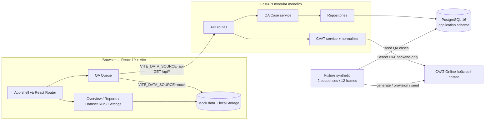
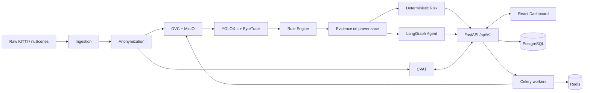
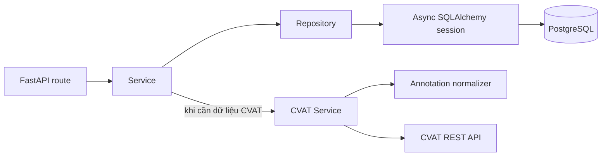
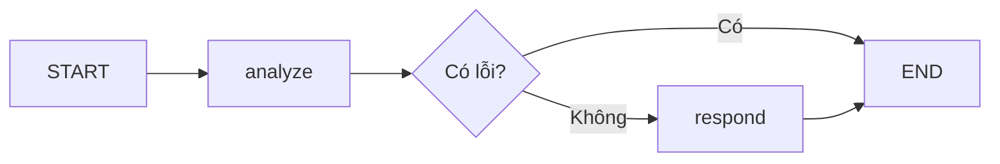
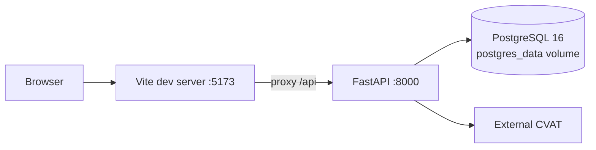

# Architecture Document — Label Guardian

> Cập nhật: 2026-08-20
> Phạm vi: kiến trúc tổng thể của source code hiện có và hướng mở rộng đã thống nhất.

Tài liệu này là điểm bắt đầu để thành viên mới hiểu hệ thống. Mỗi phần phân biệt rõ:

- **Hiện tại:** đã có trong source code và có thể chạy hoặc kiểm thử.
- **Mục tiêu:** kiến trúc dự kiến, chưa được xem là tính năng đã triển khai.

Khi tài liệu và code khác nhau, source code, migration và OpenAPI là nguồn mô tả hành vi đang chạy. Roadmap chi tiết nằm trong [`docs/LABEL_GUARDIAN_IMPLEMENTATION_PLAN.md`](docs/LABEL_GUARDIAN_IMPLEMENTATION_PLAN.md).

## System Overview

Label Guardian là hệ thống hỗ trợ QA cho annotation camera 2D trong dữ liệu perception. Hệ thống đưa các trường hợp đáng ngờ vào hàng đợi theo mức rủi ro, trình bày evidence để con người review và mở đúng CVAT Task/Job/Frame khi cần chỉnh annotation chuyên sâu.

Ranh giới trách nhiệm cốt lõi:

| Thành phần | Trách nhiệm | Không chịu trách nhiệm |
|---|---|---|
| Dashboard | QA Queue, lọc/xếp hạng, viewer so sánh, evidence và thao tác review | Chỉnh geometry annotation chuyên sâu hoặc giữ CVAT PAT |
| CVAT | Hiển thị và chỉnh box, class, track, sequence | Tính risk, quyết định review hoặc quản lý dataset version |
| Backend | API, persistence, kiểm tra mapping, proxy CVAT và điều phối workflow | Tự quyết định thay con người |
| Rule/model pipeline | Trong kiến trúc mục tiêu: sinh prediction, finding và evidence có provenance | Ghi đè Ground Truth |
| Agent | Trong kiến trúc mục tiêu: tổng hợp evidence, giải thích và đề xuất | Sửa CVAT, sync, restore, approve hoặc thay đổi risk |
| Reviewer/Annotator | Ra quyết định và chỉnh annotation theo quyền | Chia sẻ PAT cho frontend |

Baseline hiện tại phục vụ hai cách chạy:

1. **Mock mode:** toàn bộ Dashboard chạy độc lập bằng dữ liệu và state giả lập trong browser.
2. **API mode:** riêng QA Queue đọc QA Case, frame, annotation và deep-link CVAT qua FastAPI; các màn hình còn lại vẫn dùng mock state.

## Architecture Diagram

### Kiến trúc đang chạy



### Kiến trúc mục tiêu



Sơ đồ mục tiêu không đồng nghĩa các thành phần Redis, MinIO, DVC remote, Keycloak, inference, rule engine và Agent production đã tồn tại. PostgreSQL đã là persistence runtime hiện tại, nhưng HA, least-privileged roles và vận hành production vẫn là mục tiêu tiếp theo.

## Components

### 1. Frontend — React 19, TypeScript và Vite

- **Purpose:** cung cấp Dashboard QA, hiển thị hàng đợi và evidence, hỗ trợ Human-in-the-loop và điều hướng người dùng sang CVAT.
- **Entrypoint:** `frontend/src/main.tsx` và `frontend/src/App.tsx`.
- **Navigation:** React Router với clean URL, ví dụ `/qa-queue` và `/cases/{findingId}`; production host cần SPA fallback về `index.html`.
- **State hiện tại:** `MockDataProvider` và `MockRepository`; demo state được lưu trong `localStorage`.
- **Data boundary:** UI phụ thuộc vào domain types/repository contract thay vì đọc trực tiếp một file mock duy nhất.
- **Styling:** custom CSS được tách theo shell, view, queue, review workspace và UI state.

Các lớp chính:

| Khu vực | Vị trí | Vai trò |
|---|---|---|
| App shell và views | `frontend/src/App.tsx`, `frontend/src/views/` | Điều hướng và các màn hình nghiệp vụ |
| Domain | `frontend/src/domain/` | Type, permission và logic lọc/sắp xếp dùng chung |
| Mock data | `frontend/src/data/mock/` | Catalog, review data và workflow seed |
| State/repository | `frontend/src/state/` | Contract, mock operations và API adapter dự phòng |
| QA Queue | `frontend/src/features/qa-queue/` | Chọn mock/API view, viewer, analytics và presentation |
| API client | `frontend/src/api/` | DTO và các GET request tới FastAPI |
| UI components | `frontend/src/components/` | Viewer, evidence, review, CVAT context và primitives |

`VITE_DATA_SOURCE` quyết định implementation của QA Queue:

- `mock`: dùng `MockQAQueueView`; không tạo URL CVAT giả.
- `api`: dùng `ApiQAQueueView`; URL CVAT chỉ được hiển thị sau khi backend kiểm tra mapping và trả về.

Hiện tại API mode mới hỗ trợ đường đọc. Các nút xác nhận, bác bỏ và đồng bộ bị khóa vì backend chưa có Review Decision/Sync command API.

### 2. Backend — FastAPI

- **Purpose:** cung cấp REST API, đọc QA Case từ database, kết nối CVAT bằng credential backend-only và chuẩn hóa lỗi/upstream data.
- **Entrypoint:** `src/main.py`, hỗ trợ app factory để inject settings, HTTP transport và DB session trong test.
- **API assembly:** `src/api/routes.py`; route nghiệp vụ nằm trong `src/api/cvat.py` và `src/api/qa_cases.py`.
- **Validation:** Pydantic/Pydantic Settings cho config và response DTO.
- **Persistence:** SQLAlchemy async qua service/repository layers.
- **Networking:** một `httpx.AsyncClient` được quản lý theo FastAPI lifespan; không follow redirect.

Luồng phụ thuộc backend:



API baseline hiện có:

| Method | Endpoint | Chức năng |
|---|---|---|
| GET | `/health`, `/api/health` | Health của FastAPI |
| GET | `/api/cvat/health` | Kiểm tra kết nối và credential CVAT |
| GET | `/api/cvat/tasks` | Liệt kê CVAT Task |
| GET | `/api/cvat/tasks/{taskId}` | Đọc Task |
| GET | `/api/cvat/jobs` | Liệt kê Job, có thể lọc theo Task |
| GET | `/api/cvat/jobs/{jobId}` | Đọc Job |
| GET | `/api/cvat/jobs/{jobId}/frames/{frameId}` | Stream frame qua backend |
| GET | `/api/cvat/jobs/{jobId}/annotations` | Trả annotation đã normalize |
| GET | `/api/qa-cases` | Hàng đợi QA, filter/pagination cơ bản |
| GET | `/api/qa-cases/{caseId}` | Chi tiết QA Case |
| GET | `/api/qa-cases/{caseId}/cvat-link` | Deep-link sau khi xác minh mapping |
| GET | `/api/qa-cases/{caseId}/audit` | Audit seed của case |

Public API read-only hiện được công bố dưới `/api/v1`; `/api` được giữ làm compatibility alias nhưng ẩn khỏi OpenAPI. Authentication, idempotency, optimistic concurrency và command API vẫn là mục tiêu tiếp theo.

### 3. CVAT Integration

The real-dataset MVP also exposes `POST /api/v1/dataset/cvat/provision`. It
uploads selected Agent-evaluated images through the backend-only CVAT client,
records `dataset_id + version + split + image_id + SHA-256` together with the
CVAT Task/Job/Frame, and attaches that mapping to matching QA cases. The
default scope is `evaluated`; a full split can be requested explicitly.
Repeated provisioning is idempotent for unchanged image hashes.
See [`docs/CVAT_DATASET_PROVISIONING.md`](docs/CVAT_DATASET_PROVISIONING.md) for
the operator flow and API examples.

CVAT là annotation editor duy nhất; Dashboard không cố tái tạo đầy đủ công cụ chỉnh nhãn.

`CvatService` chịu trách nhiệm:

- Gửi PAT qua `Authorization: Bearer ...` từ backend.
- Map lỗi timeout, network, unauthorized, not-found, invalid response và upstream error thành error contract ổn định.
- Đọc Project/Task/Job metadata, frame và annotation.
- Chuẩn hóa shape, track và tag CVAT sang response nội bộ.
- Kiểm tra Project/Task/Job/frame của QA Case trước khi tạo deep-link.
- Không đưa PAT vào URL, response hoặc browser storage.

Với Ground Truth Job, CVAT có thể không áp dụng query `frame`; backend trả fallback URL và cảnh báo để người dùng chuyển frame thủ công.

Chi tiết tích hợp nằm tại [`docs/CVAT_INTEGRATION.md`](docs/CVAT_INTEGRATION.md).

### 4. AI Agent — LangGraph skeleton

- **Trạng thái:** mới là template kỹ thuật, chưa tham gia luồng FastAPI hoặc QA Queue.
- **Entrypoint mẫu:** `src/agents/graph.py`.
- **State mẫu:** `query`, `context`, `analysis`, `response`, `error`, `metadata` trong `src/agents/state.py`.
- **Nodes mẫu:** `analyze` và `respond`.
- **LLM factory:** `src/services/llm.py` tạo `ChatOpenAI` từ backend settings.

Flow mẫu hiện tại:



Agent production dự kiến chỉ nhận evidence có cấu trúc để giải thích và đưa recommendation. Risk score phải do thuật toán deterministic tính; Agent không được tự sửa Ground Truth, gọi sync, restore hoặc approve.

### 5. Database

- **Hiện tại:** PostgreSQL 16 + `asyncpg`, SQLAlchemy async và Alembic.
- **Cấu hình:** `DATABASE_URL` dùng URL `postgresql+asyncpg://...`; ingestion đồng bộ dùng `LABEL_GUARDIAN_DATABASE_URL` với `postgresql+psycopg://...`.
- **Migrations:** `migrations/` là nguồn chuẩn của schema và được chạy trước backend/worker.
- **Mục tiêu production:** PostgreSQL managed/HA với role ứng dụng tối thiểu quyền, backup/restore và schema workflow tiếp tục được chuẩn hóa.

Các bảng hiện tại:

| Bảng | Nội dung |
|---|---|
| `qa_cases` | Dataset/sequence/frame, lỗi, risk/priority, status, evidence, recommendation và CVAT mapping |
| `audit_logs` | Event theo case, actor, before/after JSON, metadata và timestamp |
| `qa_evaluations` | Kết quả đánh giá Agent/model trên ảnh dataset thật |
| `cvat_dataset_image_mappings` | Mapping source image với CVAT Project/Task/Job/Frame |
| `qa_images`, `qa_objects`, `qa_object_provenance` | Ảnh, object đã normalize và provenance ingestion |
| `ingestion_jobs`, `ingestion_job_events`, `ingestion_assets` | Trạng thái, event và artifact của ingestion workflow |

Database hiện mới đủ cho queue đọc và fixture seed. Append-only audit bằng DB permission, assignment workflow, annotation snapshot, sync attempt, canonical diff, approval và rollback chưa được triển khai.

### 6. Vector Store

- **Hiện tại:** chưa có vector store runtime.
- `CHROMA_PERSIST_DIR` chỉ là cấu hình kế thừa từ template; Chroma chưa được khai báo trong `pyproject.toml`.
- Label Guardian baseline không dùng RAG hay similarity search.
- Chỉ bổ sung vector store khi có use case được xác định và dữ liệu đưa vào đã đáp ứng yêu cầu privacy.

### 7. Fixture, bootstrap và developer tooling

`eval/label_guardian_mini/` là fixture synthetic xác định, gồm:

- 2 sequence × 6 frame, tổng 12 ảnh 1280 × 720.
- Các class `car`, `pedestrian`, `cyclist`, `traffic_sign`.
- Ground Truth dạng CVAT XML và COCO JSON.
- Prediction mock và 6 lỗi QA chủ đích.
- QA Case cùng mapping CVAT có thể seed vào PostgreSQL sau khi chạy Alembic.

Các script `scripts/label_guardian_*` tạo fixture, provision CVAT, seed database và chạy smoke test. Các script AI20K logging trong cùng thư mục là tooling phục vụ quy trình phát triển, không nằm trong product request path.

### 8. Testing và CI

- Backend: pytest, pytest-asyncio và Ruff.
- Frontend: Node test runner, TypeScript typecheck và Vite production build.
- Migration được kiểm tra trên PostgreSQL riêng bằng chu trình upgrade/check/downgrade/upgrade; test local dùng service `postgres-test` ở cổng `5433` và `TEST_DATABASE_URL`.
- CI trong `.github/workflows/ci.yml` chạy backend và frontend trên self-hosted Linux runner cho PR/push vào `develop` hoặc `main`.

Baseline tài liệu gần nhất ghi nhận 131 backend tests, 1 test skip và 14 frontend tests; đây chỉ là mốc tham khảo, mỗi thay đổi vẫn phải chạy lại test liên quan.

## Data Flow

### Mock mode

1. Browser khởi tạo `MockDataProvider` từ các seed trong `frontend/src/data/mock/`.
2. View gọi action qua repository contract.
3. Mock operations tạo state mới, audit/review state giả lập và lưu vào `localStorage`.
4. Không cần FastAPI, database hoặc CVAT.
5. Mock data không cung cấp external CVAT URL; nút mở CVAT được khóa.

### API/CVAT read flow

1. Frontend gọi `GET /api/qa-cases` để tải hàng đợi từ PostgreSQL qua FastAPI.
2. Người dùng chọn case; frontend dùng CVAT mapping trong response để tải frame và annotation qua FastAPI.
3. FastAPI gọi CVAT bằng PAT chỉ tồn tại ở backend.
4. Backend stream frame hoặc normalize annotation trước khi trả browser.
5. Khi người dùng bấm **Mở trong CVAT**, frontend gọi `/api/qa-cases/{caseId}/cvat-link`.
6. Backend đọc case, gọi lại CVAT để kiểm tra Job thuộc đúng Task/Project và frame nằm trong range.
7. Backend trả URL không chứa credential; browser mở URL bằng session đăng nhập CVAT riêng của người dùng.

### Fixture/bootstrap flow

1. Generator tạo dataset synthetic có thể tái lập.
2. Bootstrap script provision Project/Task/Job và upload frame/annotation lên CVAT.
3. Mapping thật được lưu trong fixture mapping file.
4. Seed script kiểm tra mapping với CVAT trước khi ghi `qa_cases` và `audit_logs` vào một transaction.
5. Chạy lại seed bỏ qua case đã tồn tại.

### Workflow production mục tiêu

```text
Dataset version → Ingestion/Privacy → CVAT + Inference → Rules
→ Evidence → Deterministic Risk + Agent explanation → QA Queue
→ Human review → CVAT correction → Manual sync → Canonical diff
→ Reviewer approval → Correction layer/Dataset version mới → Audit/Report
```

Workflow correction chuẩn là **sync trước, approval sau**. Trạng thái `approved_pending_sync` còn trong mock/schema hiện tại là trạng thái legacy và không phải contract production cuối cùng.

## Deployment Architecture

### Hiện tại

Docker Compose hiện chạy PostgreSQL và backend; frontend vẫn chạy riêng bằng Vite:



- Frontend được chạy riêng bằng Vite; chưa có frontend container hoặc reverse proxy production.
- `docker-compose.yml` khai báo `postgres`, `backend` và service `postgres-test` tách biệt cho kiểm thử.
- Backend chờ PostgreSQL healthy, chạy `alembic upgrade head`, rồi mới khởi động Uvicorn.
- Dữ liệu phát triển nằm trong named volume `postgres_data`; test database dùng cổng host `5433` và không được dùng cho dữ liệu thật.
- Docker image chạy Python 3.12, multi-stage install và non-root user.
- Compose hiện phù hợp phát triển/private staging một máy; chưa phải kiến trúc HA/multi-instance.

### Mục tiêu production

- Frontend static build phía sau reverse proxy/CDN.
- FastAPI có nhiều instance stateless.
- PostgreSQL managed/HA cho metadata và workflow; migration chạy một lần bằng release job.
- Redis + Celery cho queue CPU/GPU/report.
- MinIO cho artifact; DVC dùng S3 remote.
- Keycloak OIDC/PKCE cho authentication.
- CVAT self-hosted khi xử lý dữ liệu nhạy cảm.
- Metrics, structured logs, tracing, backup và restore drill.

## Security

### Đã áp dụng trong baseline

- Secret nằm trong `.env`; `.env` không được commit.
- CVAT PAT dùng `SecretStr`, được trim/validate và chỉ đọc trong backend.
- `CVAT_BASE_URL` từ chối embedded credentials, query string và fragment.
- Backend không follow redirect khi gọi CVAT.
- Frontend không nhận hoặc lưu PAT; deep-link không chứa token.
- Pydantic validate config, path/query parameters và response schemas.
- CORS dùng allowlist cấu hình, không cho credentials; baseline chỉ mở `GET` và `OPTIONS`.
- Lỗi CVAT được chuẩn hóa, không trả raw upstream body hoặc credential.

### Khoảng trống trước production

- Chưa có JWT/OIDC, backend RBAC hoặc user session thật.
- Role switch frontend hiện chỉ phục vụ demo và không phải security boundary.
- Chưa có rate limiting, command authorization hoặc CSRF strategy cho write API.
- Chưa có ingestion/anonymization khuôn mặt và biển số.
- Chưa enforce append-only audit bằng DB permissions.
- Chưa có secret manager, rotation policy, network segmentation hoặc production observability.

Nguyên tắc bắt buộc cho Agent/LLM: chỉ gửi evidence có cấu trúc và đã loại PII; không gửi raw image, PAT, API key hoặc credential.

## Design Decisions

| Decision | Choice | Reason |
|---|---|---|
| Product boundary | Dashboard điều phối, CVAT chỉnh annotation | Tránh xây lại annotation editor và giữ một nguồn chỉnh sửa chuyên sâu |
| Backend architecture | FastAPI modular monolith | Đủ đơn giản cho MVP, vẫn tách route/service/repository để mở rộng |
| Frontend framework | React 19 + TypeScript + Vite | Phù hợp dashboard tương tác và build/typecheck nhanh |
| Frontend data strategy | Mock-first với QA Queue API opt-in | Cho phép hoàn thiện UX trước, đồng thời giữ ranh giới tích hợp rõ |
| Navigation hiện tại | React Router | Clean URL và browser history chuẩn; production host cần SPA fallback |
| Persistence | PostgreSQL + asyncpg/psycopg + Alembic | Giữ cùng database semantics giữa phát triển, CI và triển khai |
| CVAT credential | Backend-only PAT | Browser không được giữ hoặc gửi credential CVAT |
| CVAT deep-link | Backend kiểm tra rồi mới cấp URL | Không tin mapping mock/stale và không hardcode hostname giả |
| Annotation display | Backend proxy frame và normalize annotation | Ẩn CVAT API/PAT, giữ DTO ổn định cho frontend |
| Risk | Deterministic | Có thể kiểm toán và không phụ thuộc LLM |
| Agent authority | Advisory only | Human giữ quyền quyết định; Agent không được sửa/sync/approve |
| Correction lifecycle | Sync trước, approval sau | Reviewer phê duyệt trên canonical before/after diff |
| Dataset history | Version mới, không ghi đè | Bảo toàn provenance và hỗ trợ audit/rollback |
| Large artifacts mục tiêu | DVC + MinIO | Database chỉ giữ metadata, URI và hash |
| Vector store | Chưa sử dụng | Baseline không có use case RAG đủ rõ để thêm hạ tầng |

## Repository Structure

```text
.
├── src/
│   ├── api/             FastAPI routes và dependencies
│   ├── services/        CVAT, QA Case, normalizer và LLM factory
│   ├── repositories/    Truy cập QA Case và audit data
│   ├── models/          ORM models và Pydantic schemas
│   ├── db/              Async engine/session/base
│   └── agents/          LangGraph skeleton, chưa nối runtime
├── frontend/
│   ├── src/api/         Frontend API client và DTO
│   ├── src/domain/      Domain types, permission, queue logic
│   ├── src/data/mock/   Mock catalog/review/workflow
│   ├── src/state/       Repository boundary và state operations
│   ├── src/features/    Feature modules, hiện có QA Queue
│   ├── src/views/       Các workspace/màn hình
│   └── test/            Frontend tests
├── migrations/          Alembic migrations
├── eval/                Fixture Label Guardian mini và kết quả eval
├── scripts/             Fixture, seed, CVAT smoke và AI20K tooling
├── tests/               Backend unit/integration tests
├── docs/                Thiết kế chi tiết, trạng thái, testing và roadmap
├── Dockerfile            Backend image
├── docker-compose.yml    PostgreSQL, test database và backend local
└── ARCHITECTURE.md       Tài liệu kiến trúc tổng thể này
```

## Current Scope and Roadmap

| Khu vực | Hiện tại | Bước mở rộng chính |
|---|---|---|
| Frontend | React Router; QA Queue dùng TanStack Query/API V1; các view khác dùng mock | Toàn bộ màn hình dùng API và OpenAPI-generated types |
| Backend | `/api/v1` read-only cho CVAT/QA Case; `/api` là alias | Command workflow, auth, concurrency/idempotency |
| Persistence | PostgreSQL, Alembic và schema QA/ingestion hiện có | Hoàn thiện normalized workflow schema, HA, role và backup |
| CVAT | Read, normalize, proxy frame, validated deep-link | Snapshot, sync, diff, approval, restore và webhook |
| AI/risk | Agent skeleton; evidence/risk trong fixture | Inference, rule engine, deterministic risk và Agent production |
| Data/privacy | Synthetic fixture | KITTI/nuScenes ingestion, DVC/MinIO và anonymization |
| Runtime | Compose cho PostgreSQL/backend; frontend chạy Vite | Multi-service deployment, workers, auth và observability |
| Reporting | Mock/client-side | PDF/CSV/JSON artifact có provenance |

## Related Documentation

- [`README.md`](README.md): cách cài đặt, chạy và kiểm thử nhanh.
- [`docs/PROJECT_STATUS.md`](docs/PROJECT_STATUS.md): trạng thái triển khai chi tiết.
- [`docs/LABEL_GUARDIAN_ARCHITECTURE.md`](docs/LABEL_GUARDIAN_ARCHITECTURE.md): contract nghiệp vụ và kiến trúc V1 sâu hơn.
- [`docs/LABEL_GUARDIAN_IMPLEMENTATION_PLAN.md`](docs/LABEL_GUARDIAN_IMPLEMENTATION_PLAN.md): roadmap theo phase.
- [`docs/CVAT_INTEGRATION.md`](docs/CVAT_INTEGRATION.md): mapping, proxy, deep-link và sync mục tiêu.
- [`docs/FRONTEND_UI.md`](docs/FRONTEND_UI.md): information architecture và UI behavior.
- [`docs/TESTING.md`](docs/TESTING.md): test matrix và smoke test.
