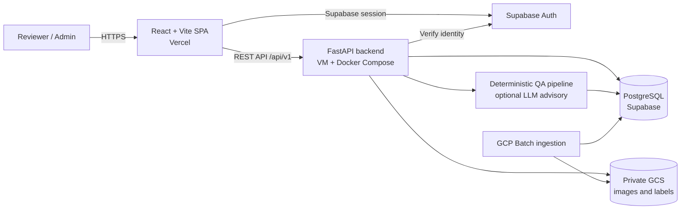
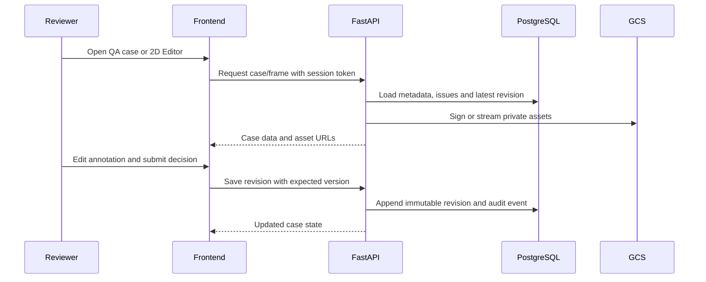

# Architecture Diagram

> Sơ đồ tóm tắt kiến trúc đang triển khai. Xem [`ARCHITECTURE.md`](../ARCHITECTURE.md) để biết contract, luồng dữ liệu và các quyết định kiến trúc đầy đủ.

## Production topology

## Review and revision flow

## Responsibility boundaries

| Component | Responsibility |
| --- | --- |
| React/Vite frontend | Authentication UX, QA queue/case views, reports, settings and 2D editing |
| FastAPI backend | Authorization, API contracts, QA orchestration, revision/audit rules and asset access |
| PostgreSQL/Supabase | Application state, roles, cases, issues, revisions and audit data |
| Private GCS | Dataset images, labels and other large immutable assets |
| GCP Batch | Long-running official dataset ingestion outside request/response traffic |
