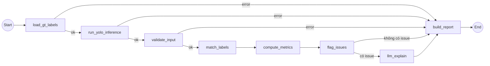

# Label QA Agent

Tài liệu giải thích agent kiểm tra chất lượng nhãn (`src/agents/`) — nhận nhãn gốc
(ground truth) của một ảnh 2D cùng kết quả dự đoán từ mô hình YOLO trên ảnh đó,
đối chiếu để phát hiện nhãn nghi ngờ có lỗi, tính chỉ số, và nhờ LLM giải thích +
đề xuất chỉnh sửa.

Install the optional runtime before running the agent locally:

```bash
python -m pip install -e ".[agent-yolo]"
```

CI installs the `agent` extra for deterministic unit tests. The `agent-yolo`
extra additionally installs Ultralytics/Torch for local model inference.

## 1. Bài toán và giả định

- **Input:** chỉ cần `image_path` — một ảnh 2D đã được gán nhãn. Agent tự đoán
  vị trí file nhãn gốc theo quy ước dataset chuẩn (`images/`↔`labels/` sibling
  folder cùng tên, hoặc cùng thư mục với ảnh cùng tên khác đuôi `.txt`/`.xml`),
  tự parse (YOLO `.txt` hoặc Pascal VOC `.xml`), và tự chạy YOLO
  (`yolo_model_name` trong config, mặc định pretrained COCO) để lấy
  `pred_labels`. Có thể truyền `label_path` rõ ràng nếu nhãn không theo quy
  ước trên — xem mục 11.
- **Output:** báo cáo QA gồm danh sách nhãn bị nghi ngờ, mức độ nghiêm trọng,
  giải thích và đề xuất sửa.
- **Nguyên tắc quan trọng:** YOLO không phải ground truth tuyệt đối. Agent chỉ
  coi khác biệt giữa label và prediction là **nghi vấn cần người review**, không
  bao giờ khẳng định chắc chắn 100% nhãn sai — vì bản thân model cũng có thể sai.
  Nguyên tắc này chi phối cách chọn threshold (mục 4) và cách viết prompt LLM
  (mục 8).
- **Trách nhiệm rạch ròi giữa code và LLM:** mọi quyết định dựa trên số liệu
  (loại lỗi là gì, mức độ nghiêm trọng nào) đều do code quyết định xong xuôi
  *trước khi* đưa cho LLM. LLM chỉ diễn giải bằng ngôn ngữ tự nhiên và đề xuất
  cách sửa — không được tự ý đổi loại lỗi hay severity. Việc này tránh
  hallucination và giúp kết quả tái lập được (cùng input → cùng issue được
  gắn cờ, chỉ câu chữ giải thích có thể khác).

## 2. Luồng xử lý (LangGraph)

Đây là pipeline tuần tự (không phải ReAct agent tự quyết định gọi tool) vì mọi
bước — chạy matching, tính metric — đều là logic xác định, cần chạy đúng thứ
tự mỗi lần.



| Node                  | File                                                        | Việc chính                                                                                                             |
| --------------------- | ------------------------------------------------------------ | ------------------------------------------------------------------------------------------------------------------------ |
| `load_gt_labels`      | [load_gt_labels.py](../src/agents/nodes/load_gt_labels.py)   | Nếu chưa có `label_path`, tự đoán từ `image_path` theo quy ước dataset; parse (YOLO `.txt` hoặc VOC `.xml`) thành `gt_labels` |
| `run_yolo_inference`  | [yolo_inference.py](../src/agents/nodes/yolo_inference.py)   | Chạy YOLO (`src/services/yolo.py`) trên `image_path` để lấy `pred_labels`              |
| `validate_input`  | [validate_input.py](../src/agents/nodes/validate_input.py) | Kiểm tra`image_path`, bbox, class_name, confidence có đủ không; tự sinh `label_id` cho gt_labels chưa có |
| `match_labels`    | [matching.py](../src/agents/nodes/matching.py)             | Ghép cặp gt ↔ pred bằng Hungarian algorithm trên ma trận IoU                                                   |
| `compute_metrics` | [metrics.py](../src/agents/nodes/metrics.py)               | Precision / Recall / F1 / class accuracy / IoU trung bình                                                           |
| `flag_issues`     | [flagging.py](../src/agents/nodes/flagging.py)             | Áp rule threshold để gắn`issue_type` + `severity` (+ `blocking`) cho từng nghi vấn                                        |
| `llm_explain`     | [llm_explain.py](../src/agents/nodes/llm_explain.py)       | Sinh`explanation` + `suggested_fix` cho từng issue (structured output) |
| `build_report`    | [report.py](../src/agents/nodes/report.py)                 | Gộp thành`qa_report` cuối cùng — `status` chỉ lên `needs_review` nếu có issue `blocking=True`                                                                 |

Ba điểm rẽ nhánh (`graph.py`):

- `load_gt_labels` lỗi (thiếu/không parse được file nhãn) → bỏ qua toàn bộ phần còn lại.
- `run_yolo_inference` lỗi (model lỗi, ảnh hỏng...) → bỏ qua phần còn lại.
- `validate_input` lỗi → bỏ qua toàn bộ pipeline, trả thẳng `qa_report` với `status="error"`.
- `flag_issues` không tìm thấy issue nào → bỏ qua `llm_explain` (đỡ tốn token/latency), trả `status="pass"` luôn.

Ba nhánh đầu (`load_gt_labels`, `run_yolo_inference`, `validate_input`) là nơi
duy nhất có thể sinh ra lỗi *fatal* (`error` trong state) — xem danh sách đầy
đủ ở mục 7.

## 3. State (`src/agents/state.py`)

`LabelQAState` là `TypedDict` — mỗi node đọc một phần và ghi (partial update)
một phần state, LangGraph tự merge:

```python
class LabelQAState(TypedDict, total=False):
    image_path: str
    label_path: str              # file nhãn gốc (.txt YOLO hoặc .xml VOC) — dùng bởi load_gt_labels
    gt_labels: list[dict]        # [{label_id, class_name, bbox: {x1,y1,x2,y2}}]
    pred_labels: list[dict]      # [{class_name, bbox: {x1,y1,x2,y2}, confidence}]

    matches: list[dict]          # cặp đã ghép: {gt_id, gt_class, pred_index, pred_class, iou, class_match}
    unmatched_gt: list[dict]     # gt không khớp pred nào, kèm best_iou/best_pred_class
    unmatched_pred: list[dict]   # pred không khớp gt nào, kèm best_iou

    metrics: dict                # precision, recall, f1, class_accuracy, avg_iou, tp/fp/fn
    flagged_issues: list[dict]   # issue_type, severity, evidence -> + explanation, suggested_fix sau llm_explain
    qa_report: dict              # output cuối cùng

    error: str
    metadata: dict
```

bbox dùng định dạng pixel tuyệt đối `{x1, y1, x2, y2}` (góc trên-trái, góc
dưới-phải). Nếu output YOLO ở định dạng khác (vd `cx, cy, w, h` chuẩn hoá
0–1), cần convert sang `x1,y1,x2,y2` trước khi đưa vào agent.

## 4. Matching và các ngưỡng (threshold)

### Matching (`matching.py`)

1. Tính ma trận IoU giữa mọi cặp `(gt, pred)`.
2. Dùng `scipy.optimize.linear_sum_assignment` trên ma trận `-IoU` để tìm
   phép ghép **tối đa hoá tổng IoU** (Hungarian algorithm) — tốt hơn greedy
   vì tránh việc một prediction "chiếm" nhầm gt tốt hơn của prediction khác.
3. Matching **không lọc theo class trước** — một cặp có thể khớp vị trí tốt
   (IoU cao) nhưng khác class. Điều này *cố ý* để phát hiện được lỗi
   `wrong_class`, thay vì bị coi nhầm thành "không khớp gì cả".
4. Với các gt/pred không lọt qua ngưỡng match, vẫn lưu lại `best_iou` (IoU
   tốt nhất tìm được, dù dưới ngưỡng) để `flag_issues` phân biệt được "có vật
   thể gần đó nhưng bbox lệch" và "không liên quan gì cả".

### Bảng ngưỡng

| Hằng số                                    | Giá trị | Ý nghĩa                                                                                                   |
| -------------------------------------------- | --------- | ----------------------------------------------------------------------------------------------------------- |
| `IOU_MATCH_THRESHOLD` (matching.py)        | 0.6       | Dưới ngưỡng này, cặp tốt nhất cũng không tính là "match"                                        |
| `LOOSE_BBOX_IOU_MAX` (flagging.py)         | 0.85      | Match hợp lệ (IoU ≥ `IOU_MATCH_THRESHOLD`) nhưng dưới mốc này vẫn coi là bbox chưa khít → `loose_bbox` |
| `SMALL_OBJECT_AREA_MAX` (flagging.py)      | 32×32 px  | GT nhỏ hơn diện tích này: `loose_bbox` vẫn tạo issue nhưng `blocking=False` (không tự đẩy status) |
| `MISSING_LABEL_CONF_HIGH` (flagging.py)    | 0.6       | Prediction tự tin cao mà không có label nào gần → nghi thiếu nhãn (severity`high`)               |
| `MISSING_LABEL_CONF_LOW` (flagging.py)     | 0.25      | Dưới mốc này thì model cũng không đủ chắc để nghi ngờ, bỏ qua                                 |
| `BBOX_MISALIGN_IOU_MIN` (flagging.py)      | 0.1       | `best_iou` >= ngưỡng này giữa gt/pred không match được coi là "cùng một vật thể, bbox lệch" |
| `DUPLICATE_GT_IOU_THRESHOLD` (flagging.py) | 0.8       | Hai gt_label cùng class, overlap gần như hoàn toàn → nghi trùng nhãn                                |

Đây là giá trị khởi điểm hợp lý cho hầu hết bài toán — nên tinh chỉnh theo
domain thực tế (vật thể nhỏ/dày đặc thường cần `IOU_MATCH_THRESHOLD` thấp hơn).
Đọc trực tiếp giá trị từ code khi cần số chính xác — các threshold này được
tinh chỉnh khá thường xuyên nên bảng trên có thể lệch nhịp so với code mới nhất.

## 5. Metrics (`compute_metrics`)

Các số liệu này đo **độ khớp giữa gt_labels và pred_labels trên một ảnh**
(dựa hoàn toàn trên kết quả `match_labels`), không phải điểm benchmark model
trên cả dataset (kiểu COCO mAP) — mục đích là làm căn cứ cho `flag_issues`
và cho người review, không phải để so sánh model qua các lần train.

**Điểm khác biệt quan trọng so với metric detection chuẩn:** TP/FP/FN ở đây
chỉ xét khớp **vị trí** (IoU ≥ `IOU_MATCH_THRESHOLD`), *không* yêu cầu đúng
class. Một cặp `wrong_class` (khớp vị trí nhưng sai class) vẫn được tính là
`true_positive`, còn đúng/sai class được đo riêng bằng `class_accuracy`. Đây
là chủ ý — nếu bắt đúng class mới tính TP thì mọi trường hợp `wrong_class` sẽ
bị tính lẫn vào FN + FP (dễ gây hiểu lầm là "model bỏ sót" thay vì "model
đoán nhầm class").

| Field              | Công thức (`tp`/`fn`/`fp` lấy từ `match_labels`)                          | Ý nghĩa                                                                                     |
| ------------------- | ---------------------------------------------------------------------------- | --------------------------------------------------------------------------------------------- |
| `true_positive`   | `len(matches)`                                                            | Số cặp gt↔pred khớp vị trí (IoU ≥ IOU_MATCH_THRESHOLD), bất kể đúng/sai class                    |
| `false_negative`  | `len(unmatched_gt)`                                                       | Số gt_label không tìm được pred nào khớp — nhãn model "bỏ sót"                     |
| `false_positive`  | `len(unmatched_pred)`                                                     | Số pred không khớp gt nào — model "phát hiện thừa" (hoặc gt bị thiếu nhãn)   |
| `precision`       | `tp / (tp + fp)`, mặc định `1.0` nếu `tp+fp == 0`                    | Trong các match tìm được, tỉ lệ có gt tương ứng thật sự — precision thấp → nghi model "thấy ảo" hoặc annotator thiếu nhãn |
| `recall`          | `tp / (tp + fn)`, mặc định `1.0` nếu `tp+fn == 0`                     | Trong các gt_label, tỉ lệ được model "xác nhận" — recall thấp → nhiều gt không có prediction tương ứng (có thể do model yếu, hoặc gt sai vị trí quá xa) |
| `f1`               | `2·precision·recall / (precision + recall)`, mặc định `0.0` nếu tổng = 0 | Trung bình điều hoà precision/recall, tóm tắt một con số                                     |
| `class_accuracy`  | `class_correct / tp` (chỉ tính trên các match), mặc định `1.0` nếu `tp == 0` | Trong các cặp đã khớp vị trí, tỉ lệ đúng luôn class — thấp → nhiều `wrong_class`     |
| `avg_iou`          | trung bình `iou` của các `matches`, mặc định `0.0` nếu `tp == 0`      | IoU trung bình của các cặp đã khớp — thấp (dù vẫn ≥ IOU_MATCH_THRESHOLD) → bbox hơi lệch dù được coi là match |

Các mặc định (`1.0`/`0.0` khi mẫu số bằng 0) để tránh chia cho 0 **và** tránh
báo động giả: ảnh không có gt_labels hoặc không có pred_labels thì không có
gì để đối chiếu, nên precision/recall mặc định "hoàn hảo" thay vì lỗi hoặc 0.

Lưu ý: `unmatched_gt`/`unmatched_pred` còn giữ `best_iou` (IoU tốt nhất tìm
được dù dưới `IOU_MATCH_THRESHOLD`) nhưng **không** được cộng vào `avg_iou`
hay bất kỳ metric nào ở trên — `best_iou` chỉ được `flag_issues` dùng để
phân loại issue (mục 6), không ảnh hưởng đến 6 con số ở bảng trên.

## 6. Các loại issue (`flag_issues`)

| `issue_type`           | Điều kiện                                                                                                                         | Severity                                                |
| ------------------------ | ------------------------------------------------------------------------------------------------------------------------------------ | ------------------------------------------------------- |
| `wrong_class`          | Matched theo vị trí (IoU ≥ `IOU_MATCH_THRESHOLD`) nhưng`class_name` khác nhau                                                                   | `high` nếu IoU ≥ 0.85, else `medium`               |
| `loose_bbox`           | Matched, đúng class, nhưng IoU < `LOOSE_BBOX_IOU_MAX` (chưa khít quanh vật thể)                                   | `low` — `blocking=False` nếu GT là vật thể nhỏ (xem mục 4) |
| `missing_label`        | Prediction không khớp gt nào, không có gt gần đó (`best_iou` < 0.1), confidence đủ cao                                   | `high` nếu confidence ≥ 0.6, `low` nếu 0.25–0.6 |
| `bbox_misaligned`      | gt không match pred nào, nhưng có pred gần đó (`best_iou` ≥ 0.1) → nghi bbox lệch/sai kích thước                      | `medium`                                              |
| `extra_or_wrong_label` | gt không match pred nào và không có pred nào gần đó (`best_iou` < 0.1) → nghi nhãn thừa hoặc sai hoàn toàn vị trí | `medium`                                              |
| `duplicate_label`      | Hai gt cùng class, IoU với nhau ≥ 0.8                                                                                             | `medium`                                              |

Mỗi issue mang theo `evidence` (dữ liệu số liệu gốc — IoU, confidence, class...
để LLM/người review truy lại vì sao bị gắn cờ) và `blocking` (mặc định `True`
— `False` chỉ có ở `loose_bbox` trên vật thể nhỏ, xem `build_report` mục 9).

`duplicate_label` là loại issue duy nhất **không** đến từ `matches`/`unmatched_gt`/
`unmatched_pred` mà so trực tiếp từng cặp `gt_labels` với nhau — vì vậy nó
không ảnh hưởng tới `metrics` ở mục 5 (không tính vào tp/fp/fn nào cả), chỉ
xuất hiện trong `flagged_issues`. `flag_issues` tính duplicate pairs **trước**
các loại issue khác để tránh double-flag: nếu 1 trong 2 box duplicate match
được, box còn lại không bị gắn thêm `bbox_misaligned`/`extra_or_wrong_label`
(vì đã được `duplicate_label` giải thích).

## 7. Các loại lỗi (`error`)

`error` là field *fatal* trong state — hễ được set thì graph nhảy thẳng tới
`build_report` với `qa_report.status = "error"`, `issues = []`, và
`summary` chính là nội dung `error`. Chỉ 3 node đầu pipeline có thể set field
này (xem sơ đồ ở mục 2); các node sau (`match_labels` trở đi) không tạo lỗi
fatal — kể cả `llm_explain` lỗi cũng không set `error` (xem mục 8).

### `load_gt_labels` (`load_gt_labels.py`)

| Thông báo (rút gọn)                                    | Khi nào xảy ra                                                                                       |
| ---------------------------------------------------------- | --------------------------------------------------------------------------------------------------------- |
| `Thiếu image_path`                                        | State không có `image_path`                                                                            |
| `Không tự tìm được file nhãn gốc cho {image_path} (...)` | Không truyền `label_path`, và không file nào trong `_candidate_label_paths` tồn tại (xem mục 11) |
| `Không tìm thấy file nhãn: {label_path}`                  | `label_path` được truyền rõ nhưng đường dẫn không tồn tại                                        |
| `Định dạng nhãn không được hỗ trợ: {suffix} (...)`      | File nhãn không phải `.txt` (YOLO) hay `.xml` (Pascal VOC)                                          |
| `Lỗi khi đọc file nhãn {label_path}: {e}`                | File tồn tại nhưng parser lỗi (nội dung sai định dạng, XML hỏng, thiếu cột...)                    |
| `File nhãn {label_path} không có nhãn nào`                | File parse được nhưng rỗng (0 object)                                                                 |

### `run_yolo_inference` (`yolo_inference.py`)

| Thông báo (rút gọn)                                     | Khi nào xảy ra                                                                                |
| ------------------------------------------------------------ | --------------------------------------------------------------------------------------------------- |
| `Thiếu image_path`                                         | Không có `image_path` (thực tế graph luôn chạy node này sau khi `load_gt_labels` đã kiểm tra) |
| `Lỗi khi chạy YOLO inference trên {image_path}: {e}`      | Model load lỗi, file ảnh hỏng/không đọc được, hoặc lỗi runtime khác từ Ultralytics            |

### `validate_input` (`validate_input.py`)

| Thông báo (rút gọn)                                          | Khi nào xảy ra                                                    |
| ------------------------------------------------------------------ | ------------------------------------------------------------------------ |
| `Thiếu image_path`                                                | Không có `image_path`                                                  |
| `gt_labels[i] thiếu bbox hợp lệ (x1, y1, x2, y2)`             | Phần tử `i` của `gt_labels` thiếu bbox hoặc thiếu 1 trong 4 toạ độ |
| `gt_labels[i] thiếu class_name`                                   | Phần tử `i` của `gt_labels` không có `class_name`                    |
| `pred_labels[i] thiếu bbox hợp lệ (x1, y1, x2, y2)`           | Phần tử `i` của `pred_labels` thiếu bbox hoặc thiếu 1 trong 4 toạ độ |
| `pred_labels[i] thiếu class_name`                                 | Phần tử `i` của `pred_labels` không có `class_name`                  |
| `pred_labels[i] thiếu confidence`                                 | Phần tử `i` của `pred_labels` không có `confidence`                  |

Trong thực tế, lỗi ở `validate_input` hiếm khi xảy ra qua đường dẫn bình
thường (`load_gt_labels`/`run_yolo_inference` tự sinh dữ liệu đúng định
dạng) — node này chủ yếu bảo vệ trường hợp `gt_labels`/`pred_labels` do
caller tự soạn tay sai định dạng, hoặc dữ liệu bất thường từ nguồn ngoài.

## 8. LLM explain — structured output

`llm_explain_node` gọi `get_llm().with_structured_output(QAIssueExplanationBatch)`
(`src/models/agent_schemas.py`) để ép LLM trả về đúng schema thay vì text tự do khó
parse:

```python
class QAIssueExplanation(BaseModel):
    issue_index: int       # map ngược lại issue trong danh sách đầu vào
    explanation: str
    suggested_fix: str

class QAIssueExplanationBatch(BaseModel):
    explanations: list[QAIssueExplanation]
```

Node gửi cho LLM danh sách issue kèm `issue_index`, `issue_type`, `severity`,
`evidence` — LLM chỉ sinh `explanation`/`suggested_fix` theo từng `issue_index`.
Khi merge kết quả về, node **giữ nguyên** `issue_type`/`severity` đã được
`flag_issues` quyết định trước đó (không lấy giá trị LLM trả — vì thực ra LLM
không được yêu cầu trả lại hai field này). Đây là lý do vì sao QA logic vẫn
đáng tin cậy dù LLM có thể "sáng tạo" câu chữ.

System prompt (`_SYSTEM_PROMPT`) yêu cầu rõ: chỉ diễn giải dựa trên `evidence`
được cấp, không suy đoán thêm chi tiết ngoài dữ liệu, và không khẳng định chắc
chắn 100% nhãn sai.

**Graceful degradation khi LLM lỗi:** nếu lời gọi LLM thất bại (hết quota, rate
limit, mất mạng, key sai...), node **không** làm hỏng toàn bộ report — `metrics`
và `flagged_issues` (đã tính xong bằng code ở các bước trước) vẫn được giữ
nguyên. Mỗi issue chỉ nhận `explanation` fallback nêu rõ lỗi gọi API, còn
`error` (field chỉ dành cho lỗi *fatal*, xem mục 7) không bị set — lỗi LLM
được ghi vào `metadata.llm_explain_error` và `build_report` chỉ thêm một câu
lưu ý vào `summary`. Nói cách khác: đây là lỗi *duy nhất* trong toàn bộ
pipeline không làm `status` thành `"error"`.

## 9. Output cuối cùng (`build_report`)

```jsonc
{
  "image_path": "img_001.jpg",
  "status": "pass" | "needs_review" | "error",
  "summary": "Phát hiện 2 nhãn nghi ngờ có lỗi (precision=0.8, recall=0.75).",
  "metrics": {
    "true_positive": 8, "false_negative": 2, "false_positive": 2,
    "class_accuracy": 0.875, "precision": 0.8, "recall": 0.8,
    "f1": 0.8, "avg_iou": 0.71
  },
  "issues": [
    {
      "label_id": "gt_3",
      "issue_type": "wrong_class",
      "severity": "high",
      "explanation": "...",
      "suggested_fix": "...",
      "evidence": { "gt_id": "gt_3", "gt_class": "car", "pred_class": "truck", "iou": 0.82, "class_match": false }
    }
  ]
}
```

Ý nghĩa từng field trong `metrics` được giải thích chi tiết ở mục 5; các
thông báo có thể xuất hiện trong `summary` khi `status="error"` được liệt kê
đầy đủ ở mục 7.

`status="error"` khi bất kỳ node nào ở nhánh đầu (`load_gt_labels`,
`run_yolo_inference`, `validate_input`) fail — trường hợp này `issues` rỗng và
`summary` chứa thông báo lỗi.

## 10. Bản đồ file

```
src/agents/
├── state.py               # LabelQAState (TypedDict)
├── geometry.py             # hàm iou() dùng chung
├── graph.py                 # nối các node + routing
└── nodes/
    ├── load_gt_labels.py    # parse label_path -> gt_labels
    ├── yolo_inference.py    # chạy YOLO -> pred_labels
    ├── validate_input.py
    ├── matching.py
    ├── metrics.py
    ├── flagging.py             # bộ luật CHÍNH THỨC (GT vs YOLO) -> qa_report
    ├── llm_explain.py
    └── report.py

src/services/
├── agent_llm.py           # get_agent_llm() — explanation client theo provider
├── llm.py                 # client Gemini tương thích cũ
└── yolo.py                # lazy cached loader + class filter helpers

src/models/agent_schemas.py # Label QA request/report and explanation contracts

tests/test_agents/          # graph, contracts, parser, matching, flags and LLM fallback
```

## 11. Cách gọi thử agent

**Cách 1 — chỉ đưa ảnh (agent tự tìm nhãn gốc + tự chạy YOLO):**

```python
from src.agents.graph import agent

result = await agent.ainvoke({"image_path": "data/images/img_001.jpg"})
print(result["qa_report"])
```

Agent tự tìm file nhãn theo thứ tự: `data/labels/img_001.txt` (swap
`images/`→`labels/`, quy ước Ultralytics), `.xml` tương ứng, rồi
`data/images/img_001.txt`/`.xml` (cùng thư mục với ảnh) — xem
`_candidate_label_paths` trong `load_gt_labels.py`. Không tìm thấy → trả
`status="error"` kèm gợi ý truyền `label_path` rõ ràng (xem mục 7).

**Cách 2 — đưa thẳng ảnh + file nhãn gốc (khi nhãn không theo quy ước ở trên):**

```python
result = await agent.ainvoke({
    "image_path": "data/img_001.jpg",
    "label_path": "data/img_001.txt",   # YOLO .txt hoặc VOC .xml
})
```

Cần `classes.txt` (một tên class mỗi dòng, index = class_id) cùng thư mục với
`label_path` nếu dùng định dạng YOLO `.txt` — nếu không có, `class_name` sẽ
là chuỗi số (`"0"`, `"1"`...) thay vì tên thật.

**Cách 3 — truyền nhãn và prediction đã có để bỏ qua file parser và YOLO:**

```python
result = await agent.ainvoke({
    "image_path": "frame-id-or-path",
    "gt_labels": [{"label_id": "gt-1", "class_name": "car", "bbox": {"x1": 1, "y1": 2, "x2": 30, "y2": 40}}],
    "pred_labels": [{"class_name": "car", "bbox": {"x1": 1, "y1": 2, "x2": 30, "y2": 40}, "confidence": 0.95}],
})
```

## 12. YOLO inference (`services/yolo.py`, `nodes/yolo_inference.py`)

- Model lấy từ `settings.yolo_model_name` (config `YOLO_MODEL_NAME`, mặc định
  `"yolo26x.pt"` — pretrained COCO, Ultralytics tự tải về nếu chưa có trong
  cache local ở lần chạy đầu tiên, khá nặng và chậm).
- `get_yolo_model()` cache bằng `lru_cache` — model chỉ load/tải một lần cho
  cả process, không phải load lại mỗi request.
- `settings.yolo_confidence_threshold` (mặc định 0.25) — ngưỡng confidence khi
  chạy inference, tương ứng tham số `conf` của Ultralytics.
- Vì model pretrained COCO chỉ nhận diện được 80 class COCO, nếu dataset của
  bạn có class riêng không nằm trong COCO, prediction cho các object đó sẽ bị
  bỏ sót hoặc gán nhầm class COCO gần giống — cân nhắc trỏ `yolo_model_name`
  sang file `.pt` tự train nếu cần độ chính xác cao hơn cho domain riêng.

## 13. Chưa làm (ngoài phạm vi hiện tại)

- `src/api/routes.py` vẫn dùng route `/chat` mẫu cũ (`ChatRequest`/`ChatResponse`),
  chưa nối sang `LabelQARequest`/`LabelQAReport`. Cần route mới kiểu
  `POST /api/v1/label-qa` gọi `agent.ainvoke(...)` rồi trả `result["qa_report"]`.
- `load_gt_labels` mới hỗ trợ YOLO `.txt` và Pascal VOC `.xml`; chưa hỗ trợ
  COCO JSON (1 file chung cho nhiều ảnh) hay các định dạng export khác.
- Threshold ở mục 4 là giá trị khởi điểm, chưa được tune trên dataset thật.

## 14. Detector khác đã thử và loại bỏ

Ngoài YOLO (detector chính thức duy nhất hiện tại), đã thử và gỡ khỏi pipeline:

- **RT-DETR** (`RTDETR` từ Ultralytics) — từng chạy song song để so sánh qua
  UI (`run_rtdetr_inference`, `app.py`), kèm bộ luật riêng đối chiếu nhãn gốc
  với đồng thời cả 2 model (`flag_issues_ensemble`). Đã gỡ hoàn toàn cả model,
  node, bộ luật ensemble và phần UI liên quan.
- **VLM detection** (Gemini/OpenAI đa phương thức qua API làm detector thứ 2,
  output normalized bbox) và **YOLO-seg segmentation** (mask polygon bổ sung)
  — từng là node riêng (`vlm_detection.py`, `segmentation.py`).
- **OWLv2** (zero-shot object detection local qua `transformers`) làm backend
  cho VLM detection — bị bỏ vì cần `candidate_labels` biết trước và chậm trên
  máy CPU-only.
