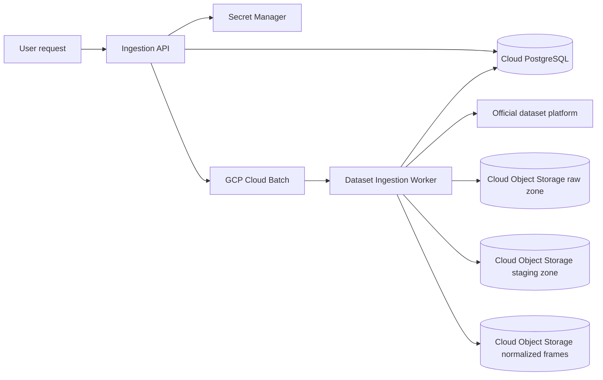

# Official Dataset Cloud Ingestion Automation

## Goal

The current cloud-native ingestion workflow imports official KITTI and nuScenes
data without storing dataset archives in the repository or developer workspace.

The workflow should stream official dataset archives into cloud object storage, process the data in workers close to storage, normalize annotations into `QAImage` and `QAObject`, and persist processing state plus QA records in a cloud database.

## Constraints

- KITTI official downloads require a CVLIBS account/session.
- nuScenes official downloads require a nuScenes account for full datasets; `v1.0-mini` has a stable public tutorial URL.
- Dataset archives are large, so worker nodes must not depend on developer laptops or local disks.
- The system must keep source provenance, review status, and idempotency guarantees from `src/models` and `src/services/ingestion`.
- Credentials must never be stored in Git, logs, object keys, or QA provenance raw payloads.

## Recommended Architecture



## Components

### Ingestion API

The authenticated API exposes ingestion state read-only:

- `GET /api/v1/ingestion/runs`
- `GET /api/v1/ingestion/runs/{run_id}`

Creating Batch jobs remains an operator/release action through `gcloud` and the
versioned request templates under `deploy/gcp/`. The UI intentionally does not
submit arbitrary archive URLs or create billable cloud jobs.

### Credential Broker

Stores provider credentials in a managed secret backend. For this project, use GCP Secret Manager.

Credential model:

- `provider`: `kitti_cvlibs` or `nuscenes`
- `owner_user_id`: user/team identity
- `auth_type`: `cookie`, `session`, `api_token`, or `oauth`
- `secret_ref`: pointer to cloud secret
- `expires_at`: nullable, used for session refresh warnings
- `last_validated_at`: latest successful provider check

Do not persist raw cookies/tokens in SQL.

### Job Queue

GCP Cloud Batch runs the worker independently of the operator's machine. Each
phase resumes from GCS checkpoints and persisted job state.

### Ingestion Worker

Implemented cloud entrypoint:

```bash
python -m src.services.ingestion.cloud_worker \
  --request-gcs-uri gs://label_guardian_bucket/ops/ingestion-runs/<run_id>/request.json \
  --phase all
```

Supported phases are `stage`, `normalize`, `validate`, `publish` and `all`.
Batch VM disk is scratch-only; published metadata points to
`datasets/official/...`, never to staging.

Worker phases:

1. `validate_credentials`: verify the official provider session.
2. `resolve_manifest`: identify official archive URLs or dataset resources from provider pages/APIs.
3. `acquire_raw`: stream archives to object storage raw zone.
4. `unpack_or_index`: unpack archives in cloud scratch storage or mount object storage through a cloud job.
5. `adapt`: run `KittiAdapter` or `NuScenesAdapter`.
6. `upload_frames`: upload normalized image objects if they are not already present.
7. `persist_records`: transactionally upsert `QAImage`, `QAObject`, and provenance records.
8. `finalize`: write counts, checksums, duration, and error summary.

Local worker disk is scratch-only and bounded; canonical output is published to
GCS and PostgreSQL.

### Object Storage Layout

Use deterministic keys so ingestion is idempotent:

```text
datasets/
  official/
    kitti/object/{split-or-run}/frames/...
    nuscenes/{version}/{split-or-run}/frames/...
  derived/
    {dataset}/{run}/yolo/...

raw/
  official/kitti/object/{archive_name}/{checksum-or-etag}.zip
  official/nuscenes/{version}/{archive_name}.tgz

ops/
  ingestion-runs/{job_id}/manifest.json
  ingestion-runs/{job_id}/result.json
```

The DB stores URLs or bucket/key references, not local paths.

Current development bucket:

```text
gs://label_guardian_bucket/datasets/official/nuscenes/v1.0-mini/product/frames/...
```

The backend streams private GCS objects through `/api/v1/dataset/images/{split}/{image_id}/content`, so the bucket does not need public read access.

### Cloud Database

Keep existing `QAImage`, `QAObject`, and `QAObjectProvenance`. Add ingestion orchestration tables:

```text
ingestion_jobs
  id
  requested_by
  provider
  dataset_type
  version
  split
  status
  source_manifest
  target_bucket
  target_prefix
  error_message
  created_at
  started_at
  finished_at

ingestion_job_events
  id
  job_id
  phase
  status
  message
  metrics
  created_at

ingestion_assets
  id
  job_id
  source_uri
  object_key
  checksum
  size_bytes
  status
  created_at
```

Idempotency keys:

- `QAImage.source_image_id`
- `QAObject.image_id + source_object_key`
- `ingestion_assets.checksum` or provider resource identifier

## Provider Strategy

### nuScenes Official

For `v1.0-mini`, use the official tutorial URL as the default source. For trainval/test/full splits, store a logged-in session or token and let the provider resolver obtain archive URLs at job runtime.

The current `NuScenesAdapter` can already load an unpacked standard nuScenes directory containing:

```text
samples/
v1.0-mini/
```

### KITTI Official

KITTI CVLIBS does not provide a stable unauthenticated API for all archives. The automation should support:

- A stored CVLIBS session cookie uploaded by the user.
- A provider resolver that opens official download endpoints while authenticated.
- Required object detection archives: `data_object_image_2.zip`, `data_object_label_2.zip`, `data_object_calib.zip`.
- For unattended Cloud Batch runs, direct archive URLs should be injected from
  Secret Manager into `KITTI_IMAGE_2_URL`, `KITTI_LABEL_2_URL`,
  `KITTI_CALIB_URL` and `KITTI_VELODYNE_URL`. Browser automation is intentionally
  not part of the cloud worker path.

After unpacking, the current `KittiAdapter` can load:

```text
training/
  image_2/
  label_2/
  calib/
```

## User Experience

The current operational flow is:

1. Store provider URLs/credentials in Secret Manager or the operator environment.
2. Upload a reviewed request document and submit the Cloud Batch template.
3. Watch job progress from the Pipeline page or API.
4. Query normalized records after the job finishes.

Local development uses the same dataset selector that cloud jobs will use:

```bash
python -m pip install -e ".[ingestion]"

python scripts/label_guardian_run_ingestion.py --interactive-selector

python scripts/label_guardian_run_ingestion.py --all-official --topic 3d --kitti-email your@email --kitti-imap-host imap.example.com --kitti-imap-user your@email

python scripts/label_guardian_run_ingestion.py \
  --source local \
  --scenario baseline_easy \
  --topic 2d \
  --dataset-root /datasets/kitti/object/training

python scripts/label_guardian_run_ingestion.py \
  --source official \
  --scenario challenging_hard \
  --topic 3d \
  --dataset-root /datasets/nuscenes \
  --nuscenes-version v1.0-mini
```

`--selector kitti` accepts either the official frame-by-frame layout
(`image_2/`, `velodyne/`, `calib/`, `label_2/`) or a KITTI-derived YOLO
detection export (`images/<split>/`, `labels/<split>/`, plus a class-name file).
Use `--split train` or `--split val` to ingest one YOLO split, or omit it to
ingest all available splits. `--selector nuscenes` validates the relational
token graph under the selected version directory: `scene.json`, `sample.json`,
`sample_data.json`, `sample_annotation.json`, and `calibrated_sensor.json`.

The repository's local real-data layout can be ingested with:

```bash
python scripts/label_guardian_run_ingestion.py \
  --source local \
  --selector kitti \
  --scenario baseline_easy \
  --dataset-root data/class.txt \
  --split val \
  --strict-layout
```

Scenario presets keep CLI, automation jobs, and future UI filters aligned:

| Scenario | Dataset | Context | Tags |
|----------|---------|---------|------|
| `baseline_easy` | KITTI | Clean Karlsruhe/European daytime driving, clear weather, low-mid traffic density | `urban_daytime`, `clear_weather`, `mid_density`, `europe` |
| `challenging_hard` | nuScenes | Congested Boston/Singapore urban driving, night/rain available, high dynamic-object density, 360-degree sensor coverage | `congested_urban`, `night_time`, `rainy`, `high_density`, `multi_region` |

When the interactive wizard chooses `Official platform`, the CLI enables official download before ingestion and prints progress for archive download/copy, extraction, layout validation, object upload, and database persistence. Topic, city, and time-of-day selections are captured as request filters; adapter-level filtering by scene metadata is the next implementation step.

KITTI object ingestion expects all four official archives: `data_object_image_2.zip`, `data_object_velodyne.zip`, `data_object_label_2.zip`, and `data_object_calib.zip`. CVLIBS sometimes returns an email/login HTML page instead of a zip archive; the downloader detects that case and asks for an authenticated session/cookie or the official emailed archive URL through `KITTI_*_URL` environment variables.

For browser-based KITTI auth, run the first login with Playwright and save cookies:

```bash
python -m pip install -e ".[ingestion]"
python -m playwright install chromium
python scripts/label_guardian_kitti_browser_login.py --cookie-json data/secrets/kitti_cookies.json
python scripts/label_guardian_run_ingestion.py --source official --scenario baseline_easy --topic 3d --kitti-cookie-json data/secrets/kitti_cookies.json --kitti-email your@email
```

Passwords are prompted without echo and are not cached unless
`--cache-kitti-imap-password` is explicitly enabled. Files under `data/secrets/`
are ignored by Git, but production deployments must use a managed secret store.

You can also combine login and ingest in one command with `--kitti-login-with-browser`. If CVLIBS still returns HTML instead of a zip after login, the CLI saves that HTML under `data/raw/diagnostics/`; use `--kitti-email` to submit the CVLIBS email/request form automatically, then pass the official direct archive links from your inbox through the `KITTI_*_URL` environment variables.

## Failure Handling

- Credential expired: mark job `blocked_credentials` and notify the requester.
- Archive checksum mismatch: mark asset failed, keep the raw failed object under quarantine.
- Worker restart: resume from `ingestion_assets` and object key existence checks.
- Duplicate request: return the existing active or completed job if request identity matches.
- Partial object upload: retry the idempotent phase; do not publish staging data
  until validation succeeds.

## Current limitations

- The API/UI monitors runs but does not create or cancel Cloud Batch jobs.
- KITTI may still require a browser session or emailed direct links from CVLIBS.
- Full trainval ingestion needs a larger Batch disk/runtime than the smoke templates.
- Provider credentials and archive URLs are operator-managed secrets; they are
  never persisted in Git or QA evidence.

For automatic KITTI download, use scoped IMAP/app credentials only when CVLIBS
requires emailed direct links. Playwright cookies under `data/secrets/` are a
local operator cache ignored by Git, not production credential storage.
