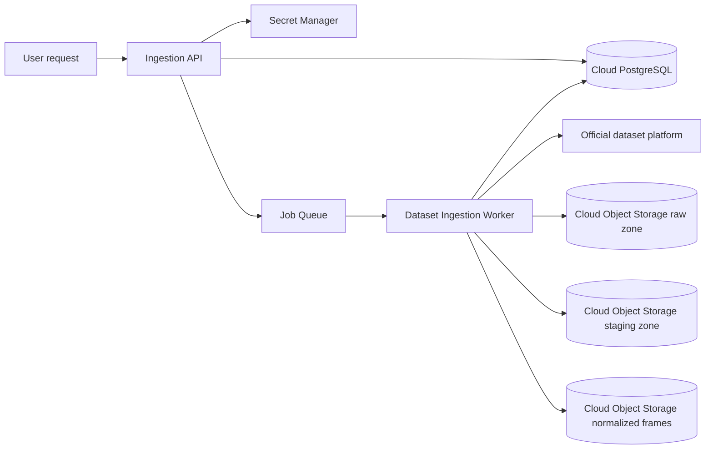

# Official Dataset Cloud Ingestion Automation

## Goal

Build a cloud-native ingestion workflow for Label Guardian that can ingest official KITTI and nuScenes datasets from user requests without requiring operators to download archives manually or paste one-off links into scripts.

The workflow should stream official dataset archives into cloud object storage, process the data in workers close to storage, normalize annotations into `QAImage` and `QAObject`, and persist processing state plus QA records in a cloud database.

## Constraints

- KITTI official downloads require a CVLIBS account/session.
- nuScenes official downloads require a nuScenes account for full datasets; `v1.0-mini` has a stable public tutorial URL.
- Dataset archives are large, so worker nodes must not depend on developer laptops or local disks.
- The system must keep source provenance, review status, and idempotency guarantees from `src/models` and `src/services/ingestion`.
- Credentials must never be stored in Git, logs, object keys, or QA provenance raw payloads.

## Recommended Architecture



## Components

### Ingestion API

Owns user-facing dataset requests.

Suggested endpoints:

- `POST /ingestion/credentials/{provider}`: store or rotate official provider credentials.
- `POST /ingestion/jobs`: create a dataset ingestion job from a user request.
- `GET /ingestion/jobs/{job_id}`: report progress, counts, current phase, and errors.
- `POST /ingestion/jobs/{job_id}/cancel`: request cancellation.

Example job request:

```json
{
  "provider": "official",
  "dataset_type": "nuscenes",
  "version": "v1.0-mini",
  "split": "mini",
  "max_samples": null,
  "target_bucket_prefix": "datasets/nuscenes/v1.0-mini"
}
```

For KITTI:

```json
{
  "provider": "official",
  "dataset_type": "kitti",
  "task": "object_detection",
  "split": "training",
  "archives": ["image_2", "label_2", "calib"],
  "target_bucket_prefix": "datasets/kitti/object"
}
```

### Credential Broker

Stores provider credentials in a managed secret backend. For this project, use GCP Secret Manager.

Credential model:

- `provider`: `kitti_cvlibs` or `nuscenes`
- `owner_user_id`: user/team identity
- `auth_type`: `cookie`, `session`, `api_token`, or `oauth`
- `secret_ref`: pointer to cloud secret
- `expires_at`: nullable, used for session refresh warnings
- `last_validated_at`: latest successful provider check

Do not persist raw cookies/tokens in SQL.

### Job Queue

Use a durable queue so jobs can run for hours:

- GCP: Workflows or Cloud Run trigger + Cloud Batch worker
- Portable: Celery + Redis/RabbitMQ, or Argo Workflows on Kubernetes

Each job should be resumable by checking object storage and database state.

### Ingestion Worker

Implemented cloud entrypoint:

```bash
python -m src.services.ingestion.cloud_worker \
  --request-gcs-uri gs://label_guardian_bucket/ops/ingestion-runs/<run_id>/request.json \
  --phase all
```

Supported phases are `stage`, `normalize`, `validate`, `publish` and `all`.
Batch VM disk is scratch-only; published metadata points to
`datasets/official/...`, never to staging.

Worker phases:

1. `validate_credentials`: verify the official provider session.
2. `resolve_manifest`: identify official archive URLs or dataset resources from provider pages/APIs.
3. `acquire_raw`: stream archives to object storage raw zone.
4. `unpack_or_index`: unpack archives in cloud scratch storage or mount object storage through a cloud job.
5. `adapt`: run `KittiAdapter` or `NuScenesAdapter`.
6. `upload_frames`: upload normalized image objects if they are not already present.
7. `persist_records`: transactionally upsert `QAImage`, `QAObject`, and provenance records.
8. `finalize`: write counts, checksums, duration, and error summary.

The worker should use multipart upload for archives and images. Local disk should be scratch-only and bounded.

### Object Storage Layout

Use deterministic keys so ingestion is idempotent:

```text
datasets/
  official/
    kitti/object/{split-or-run}/frames/...
    nuscenes/{version}/{split-or-run}/frames/...
  derived/
    {dataset}/{run}/yolo/...

raw/
  official/kitti/object/{archive_name}/{checksum-or-etag}.zip
  official/nuscenes/{version}/{archive_name}.tgz

ops/
  ingestion-runs/{job_id}/manifest.json
  ingestion-runs/{job_id}/result.json
```

The DB stores URLs or bucket/key references, not local paths.

Current development bucket:

```text
gs://label_guardian_bucket/datasets/official/nuscenes/v1.0-mini/smoke/frames/...
```

The backend streams private GCS objects through `/api/v1/dataset/images/{split}/{image_id}/content`, so the bucket does not need public read access.

### Cloud Database

Keep existing `QAImage`, `QAObject`, and `QAObjectProvenance`. Add ingestion orchestration tables:

```text
ingestion_jobs
  id
  requested_by
  provider
  dataset_type
  version
  split
  status
  source_manifest
  target_bucket
  target_prefix
  error_message
  created_at
  started_at
  finished_at

ingestion_job_events
  id
  job_id
  phase
  status
  message
  metrics
  created_at

ingestion_assets
  id
  job_id
  source_uri
  object_key
  checksum
  size_bytes
  status
  created_at
```

Idempotency keys:

- `QAImage.source_image_id`
- `QAObject.image_id + source_object_key`
- `ingestion_assets.checksum` or provider resource identifier

## Provider Strategy

### nuScenes Official

For `v1.0-mini`, use the official tutorial URL as the default source. For trainval/test/full splits, store a logged-in session or token and let the provider resolver obtain archive URLs at job runtime.

The current `NuScenesAdapter` can already load an unpacked standard nuScenes directory containing:

```text
samples/
v1.0-mini/
```

### KITTI Official

KITTI CVLIBS does not provide a stable unauthenticated API for all archives. The automation should support:

- A stored CVLIBS session cookie uploaded by the user.
- A provider resolver that opens official download endpoints while authenticated.
- Required object detection archives: `data_object_image_2.zip`, `data_object_label_2.zip`, `data_object_calib.zip`.
- For unattended Cloud Batch runs, direct archive URLs should be injected from
  Secret Manager into `KITTI_IMAGE_2_URL`, `KITTI_LABEL_2_URL`,
  `KITTI_CALIB_URL` and `KITTI_VELODYNE_URL`. Browser automation is intentionally
  not part of the cloud worker path.

After unpacking, the current `KittiAdapter` can load:

```text
training/
  image_2/
  label_2/
  calib/
```

## User Experience

The user should not paste dataset URLs into scripts. They should:

1. Connect an official dataset account once.
2. Create an ingestion request from UI/API.
3. Watch job progress.
4. Query normalized records after the job finishes.

Local development uses the same dataset selector that cloud jobs will use:

```bash
python -m pip install -e ".[ingestion]"

python scripts/label_guardian_run_ingestion.py --interactive-selector

python scripts/label_guardian_run_ingestion.py --all-official --topic 3d --kitti-email your@email --kitti-imap-host imap.example.com --kitti-imap-user your@email

python scripts/label_guardian_run_ingestion.py \
  --source local \
  --scenario baseline_easy \
  --topic 2d \
  --dataset-root /datasets/kitti/object/training

python scripts/label_guardian_run_ingestion.py \
  --source official \
  --scenario challenging_hard \
  --topic 3d \
  --dataset-root /datasets/nuscenes \
  --nuscenes-version v1.0-mini
```

`--selector kitti` accepts either the official frame-by-frame layout
(`image_2/`, `velodyne/`, `calib/`, `label_2/`) or a KITTI-derived YOLO
detection export (`images/<split>/`, `labels/<split>/`, plus a class-name file).
Use `--split train` or `--split val` to ingest one YOLO split, or omit it to
ingest all available splits. `--selector nuscenes` validates the relational
token graph under the selected version directory: `scene.json`, `sample.json`,
`sample_data.json`, `sample_annotation.json`, and `calibrated_sensor.json`.

The repository's local real-data layout can be ingested with:

```bash
python scripts/label_guardian_run_ingestion.py \
  --source local \
  --selector kitti \
  --scenario baseline_easy \
  --dataset-root data/class.txt \
  --split val \
  --strict-layout
```

Scenario presets keep CLI, automation jobs, and future UI filters aligned:

| Scenario | Dataset | Context | Tags |
|----------|---------|---------|------|
| `baseline_easy` | KITTI | Clean Karlsruhe/European daytime driving, clear weather, low-mid traffic density | `urban_daytime`, `clear_weather`, `mid_density`, `europe` |
| `challenging_hard` | nuScenes | Congested Boston/Singapore urban driving, night/rain available, high dynamic-object density, 360-degree sensor coverage | `congested_urban`, `night_time`, `rainy`, `high_density`, `multi_region` |

When the interactive wizard chooses `Official platform`, the CLI enables official download before ingestion and prints progress for archive download/copy, extraction, layout validation, object upload, and database persistence. Topic, city, and time-of-day selections are captured as request filters; adapter-level filtering by scene metadata is the next implementation step.

KITTI object ingestion expects all four official archives: `data_object_image_2.zip`, `data_object_velodyne.zip`, `data_object_label_2.zip`, and `data_object_calib.zip`. CVLIBS sometimes returns an email/login HTML page instead of a zip archive; the downloader detects that case and asks for an authenticated session/cookie or the official emailed archive URL through `KITTI_*_URL` environment variables.

For browser-based KITTI auth, run the first login with Playwright and save cookies:

```bash
python -m pip install -e ".[ingestion]"
python -m playwright install chromium
python scripts/label_guardian_kitti_browser_login.py --cookie-json data/secrets/kitti_cookies.json
python scripts/label_guardian_run_ingestion.py --source official --scenario baseline_easy --topic 3d --kitti-cookie-json data/secrets/kitti_cookies.json --kitti-email your@email
```

Passwords are prompted without echo and are not cached unless
`--cache-kitti-imap-password` is explicitly enabled. Files under `data/secrets/`
are ignored by Git, but production deployments must use a managed secret store.

You can also combine login and ingest in one command with `--kitti-login-with-browser`. If CVLIBS still returns HTML instead of a zip after login, the CLI saves that HTML under `data/raw/diagnostics/`; use `--kitti-email` to submit the CVLIBS email/request form automatically, then pass the official direct archive links from your inbox through the `KITTI_*_URL` environment variables.

Example CLI wrapper for development:

```bash
label-guardian ingest create \
  --provider official \
  --dataset nuscenes \
  --version v1.0-mini \
  --storage s3://label-guardian-prod/datasets/nuscenes/v1.0-mini
```

## Failure Handling

- Credential expired: mark job `blocked_credentials` and notify the requester.
- Archive checksum mismatch: mark asset failed, keep the raw failed object under quarantine.
- Worker restart: resume from `ingestion_assets` and object key existence checks.
- Duplicate request: return the existing active or completed job if request identity matches.
- Partial object upload: use multipart upload abort and retry with exponential backoff.

## Implementation Roadmap

### Implemented Local Foundation

- `IngestionJob`, `IngestionJobEvent`, and `IngestionAsset` SQLAlchemy models are available through the shared `Base` metadata.
- Alembic migration `3944daf20671` owns the ingestion schema; production code does not call `create_all`.
- `IngestionAutomationService` can create idempotent local ingestion jobs, run KITTI/nuScenes adapters, upload through the existing S3-compatible client interface, and persist job events/results.
- `IngestionSettings.object_key_prefix` lets local tests and future cloud workers write deterministic object keys under a dataset/job prefix.

### Phase 1: Cloud-ready backend contracts

- Add `IngestionJob`, `IngestionJobEvent`, and `IngestionAsset` SQLAlchemy models.
- Add service methods to create jobs and record phase progress.
- Extend settings for cloud object storage and cloud DB URLs.

### Phase 2: Worker abstraction

- Extract the current local `label_guardian_run_ingestion.py` flow into reusable worker services.
- Keep local filesystem storage as a dev implementation.
- Add S3-compatible cloud storage implementation using boto3 multipart upload.

### Phase 3: Provider connectors

- Add `OfficialKittiProvider` and `OfficialNuScenesProvider`.
- Store provider credentials by secret reference, not raw secret.
- Resolve official resources at runtime based on dataset request.

### Phase 4: Production orchestration

- Add queue consumer worker.
- Add progress events and retry policy.
- Add opt-in integration tests against local PostgreSQL plus real GCP/Supabase cloud in CI secrets.

### Phase 5: UI/API

- Add API endpoints for credential setup, job creation, job status, and cancellation.
- Add dataset request validation so users select dataset/version/split rather than entering URLs.

## Open Decisions

- Cloud target: GCP Cloud Storage for objects and Supabase PostgreSQL for metadata.
- Job runner: Celery, cloud-native batch service, or Kubernetes workflow engine.
- Credential UX: browser login handoff, uploaded cookie file, or manually entered token/session.
- Whether full official trainval/test datasets should be unpacked fully or indexed lazily from archives.

For fully automatic KITTI ingestion, provide IMAP credentials so the CLI can read the CVLIBS email link and continue downloading without manual inbox steps. Prefer an app password or scoped mailbox credential.

After the first Playwright login, `data/secrets/kitti_cookies.json` is reused automatically by `label_guardian_run_ingestion.py`; use `--kitti-login-with-browser` only when you need to create or refresh that saved session. IMAP credentials are only needed if CVLIBS requires emailed direct archive links and you want the CLI to read those links automatically.
